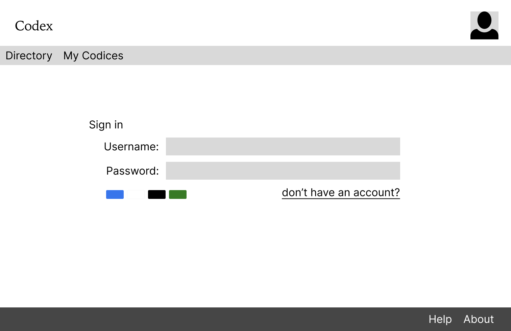
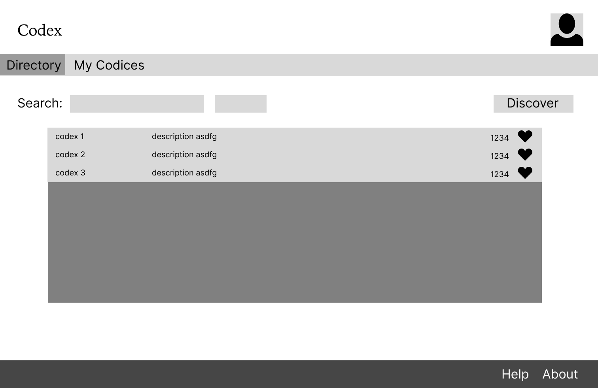
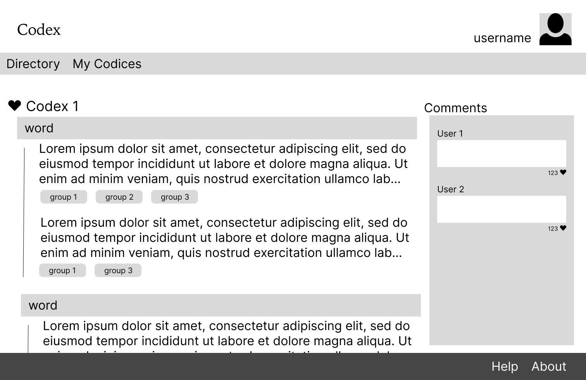
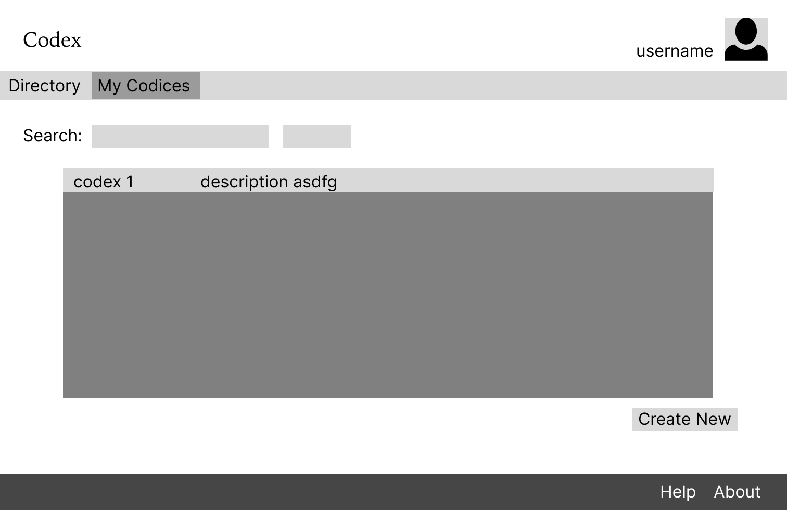
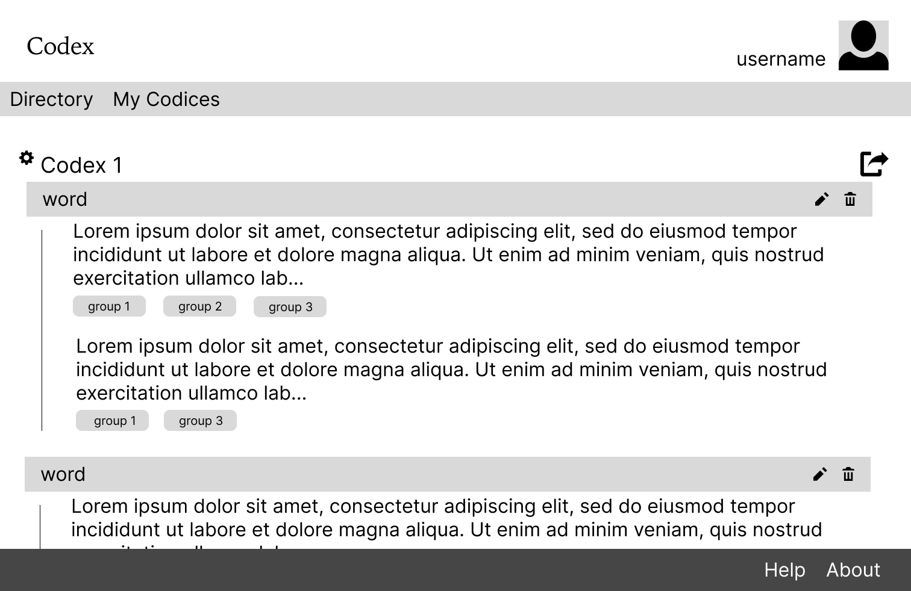
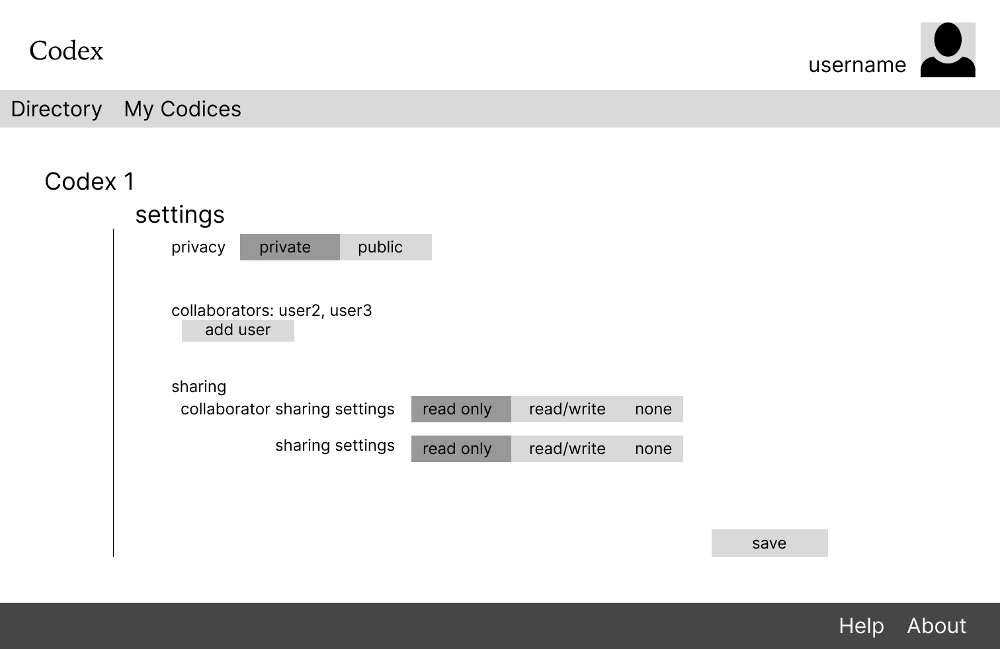
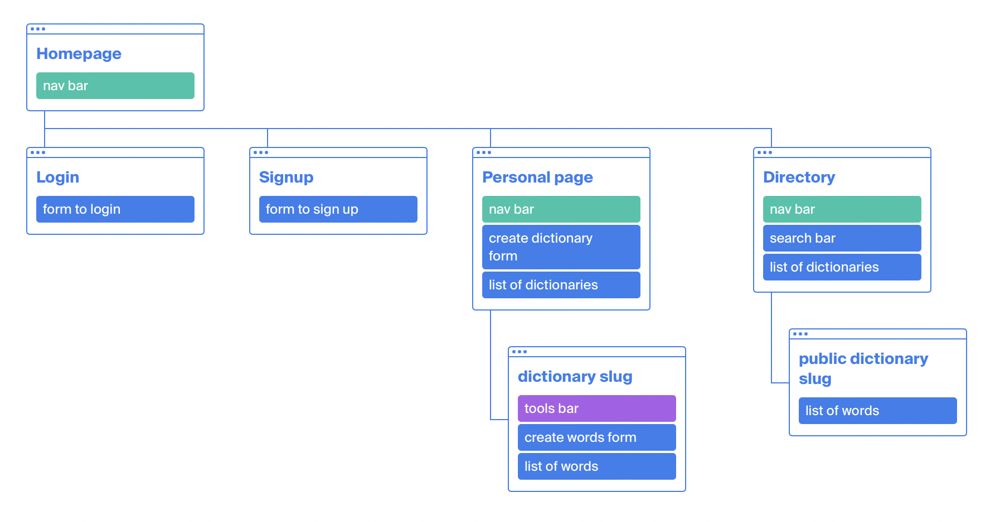

# Co-dex

Overview
---
Codex is a community-based dictionary to share lists of words – from standard dictionaries to made-up languages – amongst friends and family, book clubs, or other communities.

Users can register, login, create private, collaborative, or public dictionaries and share them with others.


Data Model
---
example User:
```
{
	username: "aegon",
	email: jsnow@wall.org,
	passwordHash: //password,
	codices: //array of references to Codex documents
}
```

example Codex:
```
{
	owner: //reference to creator of dictionary
	public: true,
	collaborators: //array of users,
	publicPermissions: "r",
	collaboratorPermissions: "rw",
	name: "Language of GOT",
	words: //array of references to words,
	filters: ["type", "tongue"]
}
```

example Word:
```
{
	owner: //reference to creator of word
	word: "rakh",
	definitions: [
		{definition: "a boy", 
		filters: {type: "-", tongue: "dorthraki"}}
	],
	starred: true,
}
```
<a href = "models/codex.mjs">Link to Codex draft</a>

<a href = "models/user.mjs">Link to user draft</a>

### WireFrames
`/login`


`/directory`


`/directory/slug` - specific public dictionary


`/my-codices`


`/my-codices/slug` - specific owned/collaborating dictionary


`/my-codices/slug/settings`


### Site map


### User stories/ use cases
1. as a non-registered user, I can register for an account
2. as a non-registered user, I can view a directory of public dictionaries
3. as a user, I can log into the site
4. as a user, I can create new dictionaries
5. as a user, I can edit my dictionaries (CRUD words)
6. as a user, I can share dictionaries (or not), with whom I choose
7. as a user, I can collaborate with others on a dictionary

### Research topics
- Language APIs (1 point)
  - to add existing words from dictionaries easily, I'll use an english dictionary API
- authentication API (1 point)
- form validation API (1 point)
- automated testing (5 points) or unit testing (3 points)
  - with headless chrome, to test routes & forms
  - or with Jest
- react.js (4 points)